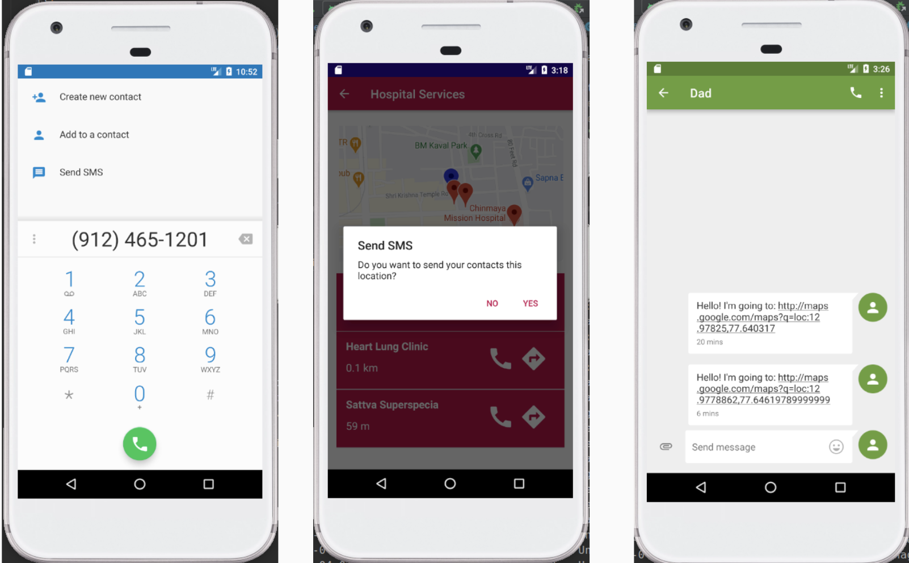
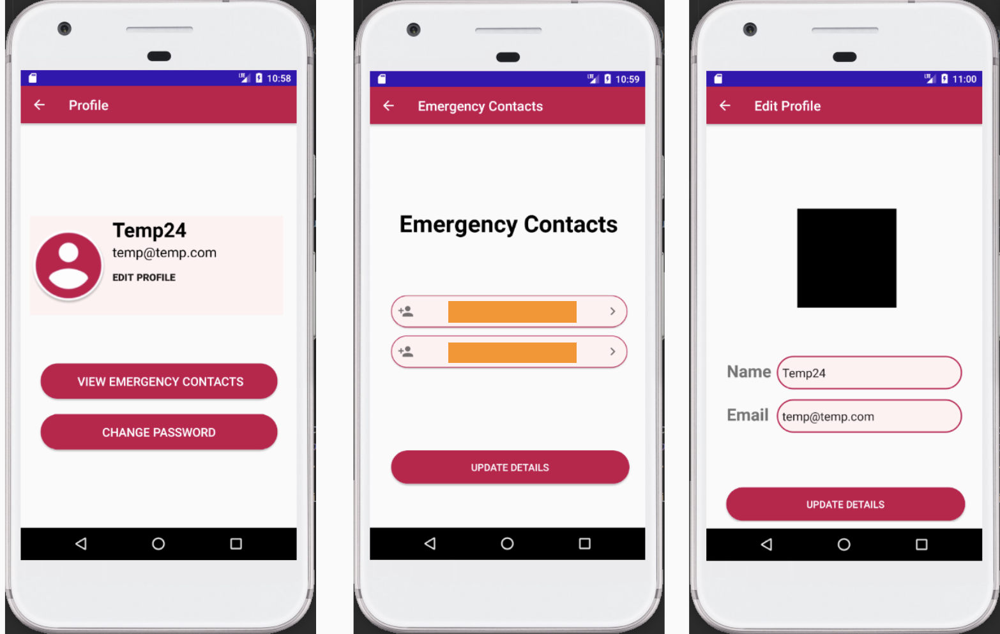

# findE

findE is an Android emergency application that provides the means
for locating the user's nearby emergency services. In addition to providing local hospitals, police stations, and emergency facilities, the app offers for storing emergency contacts. If the user chooses a service in case of any emergency, the app informs these emergency contacts via SMS. Furthermore, the app provides these sites' contact numbers and directions to the nearest emergency departments. 

## findE Working

Dashboard to access the emergency services.

Calling emergency contacts and sending SMS.

Adding emergency details and updating profile.

## Functional Requirements

The user should be able to:
- Create an account using his email and a valid password
- Add emergency contacts from his phone’s contact list
- See his/her current location
- See all the services available nearby
- Select any of the services shown 
- Edit their profile
- Change their emergency contacts
- Send a sms to the emergency contacts through  the app

## Non-Functional Requirements

- Usability Requirements:
  - Should be easy to use and not complicated.
  - User Interface must guide user.
  - GUI shall be simple and clear.
- Performance Requirements:
  - The application shall be fast and robust when loading.
  - The program shall not allow more than 2 min of failure in a month.
- Reliability Requirements:
  - The application shall not produce an incorrect output.
- Portability Requirements:
  - The software shall work in all versions of Android since 4.4 KitKat.
- Security Requirements:
  - Users must be authenticated and validated using a valid email and password
  - The  application  must be accountable so that a member couldn’t see other members' accounts

## Database

In this project we use Firebase Cloud Firestore, it is
a flexible, scalable NoSQL cloud database to store and sync data for client- and server-side
development. It offers seamless integration with other Firebase and Google Cloud products, including
Cloud Functions. Firestore stores simple data in documents which are very similar to JSON.

