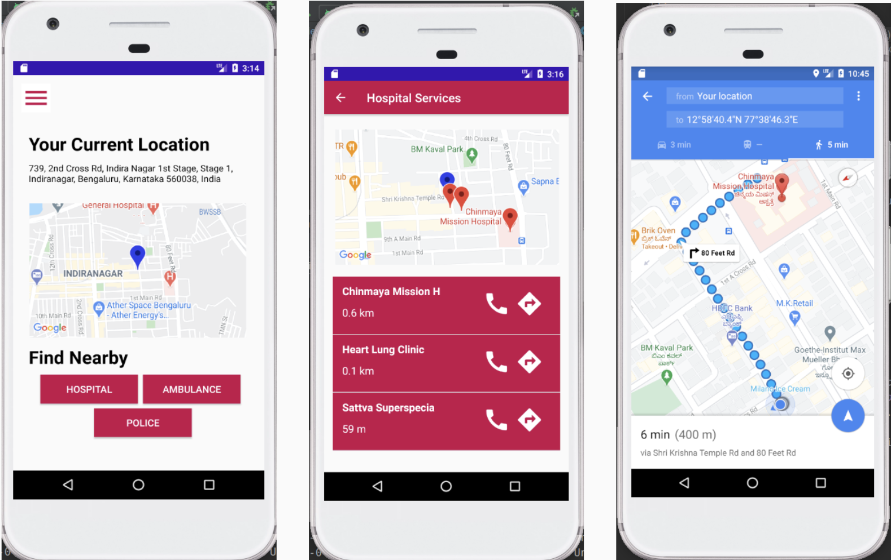

# findE

findE is an emergency app for locating nearby emergency services.

## findE Working

Dashboard to access the emergency services.

Calling emergency contacts and sending SMS.

Adding emergency details and updating profile.

## Functional Requirements

The user should be able to:
- Create an account using his email and a valid password
- Add emergency contacts from his phone’s contact list
- See his/her current location
- See all the services available nearby
- Select any of the services shown 
- Edit their profile
- Change their emergency contacts
- Send a sms to the emergency contacts through  the app

## Non-Functional Requirements

- Usability Requirements:
  - Should be easy to use and not complicated.
  - User Interface must guide user.
  - GUI shall be simple and clear.
- Performance Requirements:
  - The application shall be fast and robust when loading.
  - The program shall not allow more than 2 min of failure in a month.
- Reliability Requirements:
  - The application shall not produce an incorrect output.
- Portability Requirements:
  - The software shall work in all versions of Android since 4.4 KitKat.
- Security Requirements:
  - Users must be authenticated and validated using a valid email and password
  - The  application  must be accountable so that a member couldn’t see other members' accounts

